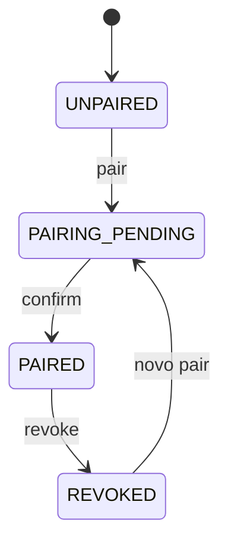
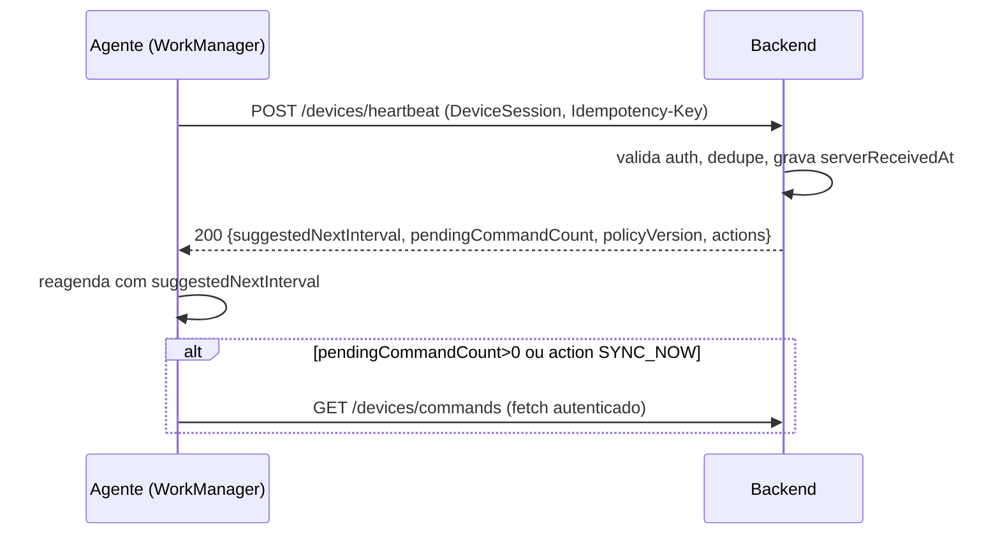
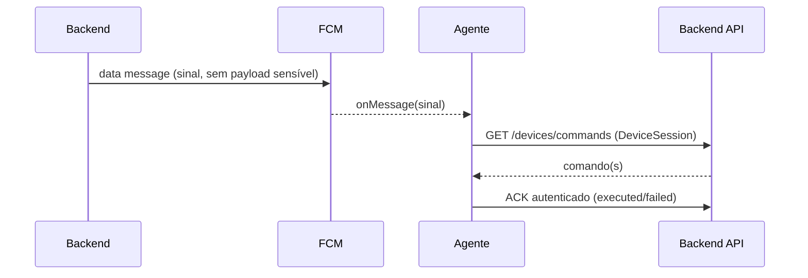

# Modelo de domínio, DeviceState e Heartbeat — NextGuardian

Data: 2026-09-11. Documento de desenho. Estende o domínio já em código (`domain/Models.kt`), sem substituí-lo.

<a id="dominio"></a>
## 1. Modelo de domínio e multitenancy

O NextGuardian nasce **multi-tenant**. `Account` do código atual é o embrião do `Tenant`. Nenhuma consulta cruza tenant. Um tenant pode ser uma **família** ou uma **organização** — o mesmo isolamento serve os dois perfis do produto ([doc 13](13-modelo-produto-core-perfis.md)); `Tenant.profile` seleciona feature flags/módulos sem duplicar backend.

### Entidades

| Entidade | Responsabilidade | Invariantes-chave |
| --- | --- | --- |
| `Tenant` | Organização/cliente; unidade de isolamento | Todo dado sensível referencia `tenantId`; trial e limites pertencem ao tenant |
| `User` | Pessoa autenticável | Senha só como hash no servidor; e-mail único por escopo; pode pertencer a vários tenants via `Membership` |
| `Membership` | Vínculo User↔Tenant com papel | `(userId, tenantId)` único; papel ∈ RBAC |
| `Device` | Aparelho vinculado | Pertence a um tenant; transferência exige revogação + novo vínculo |
| `Enrollment` | Processo/registro de vínculo | Estados = `DevicePairingState`; consumo atômico do código |
| `ActivationCode` | Autorização temporária de vínculo | Expira; uso único; limite de tentativas |
| `Subscription` | Direitos e período | Trial/pagamento decididos no servidor (UTC); um trial por tenant |
| `Plan` | Oferta comercial | Limite de dispositivos; preço próprio |
| `Policy` | Regras de conformidade aplicáveis a devices | Versionada; `policyVersion` propagado ao device |
| `Event` | Evento na timeline do device | Sem conteúdo privado; ver [doc 14](14-eventos-timeline.md) |
| `Alert` | Resultado de regra disparada | Liga a `Event`/regra; `acknowledgedBy/At` |
| `Command` | Ação servidor→device | Ciclo de vida idempotente; ver [doc 15](15-motor-regras-comandos.md) |
| `AuditLog` | Trilha de ações administrativas | Resistente a alteração; sem segredos; ver [doc 18](18-seguranca-privacidade-threat-model.md) |
| `DeviceSession` | Credenciais do device | Separada de token de conta e de FCM; rotacionável/revogável |

Preservados do código atual e reaproveitados: `Account`(→`Tenant`), `User`, `Device`, `ActivationCode`, `Subscription`, `DeviceInfo`, `DevicePairingState`, `SubscriptionState`, `ConnectionState`, `ActivationState`, `PairingTransitions`, `ActivationValidator`.

### RBAC

| Papel | Pode |
| --- | --- |
| `owner` | Tudo no tenant, incluindo billing, exclusão do tenant, gerir admins |
| `admin` | Gerir devices, políticas, comandos, usuários (exceto owner), ver auditoria |
| `operator` | Operar devices (comandos legítimos, reconhecer alertas), sem gerir usuários/billing |
| `viewer` | Somente leitura de dashboard/timeline/relatórios |

Toda ação sensível gera `AuditLog`. Autorização é verificada por `tenantId` + papel em cada request; acesso entre tenants **falha** (teste obrigatório).

## 2. DeviceState — estado rico

Um dispositivo **nunca** é "Connected" só por estar vinculado. O estado apresentado é **derivado** de sinais com timestamp e frescor.

### Campos de estado (snapshot do servidor)

```
DeviceState {
  deviceId, tenantId
  enrollment: DevicePairingState        // UNPAIRED|PAIRING_PENDING|PAIRED|REVOKED
  activation: ActivationState
  subscription: SubscriptionState        // TRIAL|ACTIVE|EXPIRED|CANCELLED
  connectivity: ConnectionState          // derivado, não autoridade de vínculo
  lastSeen                               // qualquer request autenticado do device
  lastHeartbeat                          // último heartbeat aceito (serverReceivedAt)
  lastSuccessfulSync                     // última sync completa
  agentVersion, androidVersion, apiLevel
  battery, charging, networkType
  permissions: { <perm>: GRANTED|DENIED|RESTRICTED|UNKNOWN }
  policyVersion, policyCompliance: COMPLIANT|NON_COMPLIANT|UNKNOWN
  integrity: OK|SUSPECT|UNKNOWN          // Play Integrity, futuro
  pendingCommandCount
  presence: PresenceState                // derivado (abaixo)
  lifecycle: LifecycleState              // derivado (abaixo)
}
```

### Presença (derivada de `lastHeartbeat`/`lastSeen`, limiares configuráveis por tenant)

| PresenceState | Regra padrão |
| --- | --- |
| `ONLINE` | último sinal ≤ 2× intervalo de heartbeat |
| `RECENTLY_SEEN` | ≤ 6× intervalo |
| `STALE` | ≤ 24 h |
| `OFFLINE` | > 24 h |

### Ciclo de vida (independente de presença)

| LifecycleState | Significado |
| --- | --- |
| `ACTIVE` | vinculado e assinatura vigente |
| `TRIAL` | vinculado em período de trial |
| `SUSPENDED` | assinatura expirada/cancelada — vínculo mantido, funções restritas |
| `REVOKED` | vínculo revogado; sessões invalidadas |
| `NON_COMPLIANT` | política não atendida (sobrepõe apresentação, não o vínculo) |

Presença, ciclo de vida, assinatura e conectividade são **eixos ortogonais**. Um device pode ser `OFFLINE` + `ACTIVE` + `NON_COMPLIANT` simultaneamente. O dashboard mostra os eixos separados.

### Máquina de transições (resumo)


(Já implementada em `PairingTransitions`; presença/lifecycle são camadas derivadas no servidor, não substituem esta máquina.)

## 3. Heartbeat — contrato e política

### Payload proposto (`DeviceHeartbeat`, estende `HeartbeatRequest` atual)

Campos já contratados: `deviceId, appVersion, androidVersion, manufacturer, model, batteryLevel, networkType, timestamp`.

Campos a acrescentar (todos opt-in, sem conteúdo privado):
```
installationId, apiLevel, charging(bool),
connectivity, permissionsState{...}, locationCapability(NONE|FOREGROUND|BACKGROUND),
policyVersion, policyCompliance, pendingCommandCount, lastCommandResult
```
`serverReceivedAt` é a autoridade temporal; `timestamp` do cliente é **não confiável**.

### Política de envio

| Aspecto | Decisão |
| --- | --- |
| Periodicidade | WorkManager periódico (mín. 15 min); intervalo efetivo configurável por tenant/plano |
| Latência baixa | FCM *data* dispara `SYNC_NOW`/`REQUEST_CHECKIN` sob demanda |
| Offline | enfileirar 1 heartbeat pendente (coalescido); enviar ao reconectar |
| Retry/backoff | exponencial com jitter; teto; sem polling agressivo |
| Deduplicação | `installationId + intervalo` no servidor; heartbeats antigos não retrocedem estado |
| Bateria | trabalho adiável; nunca FGS permanente só para heartbeat |
| Pós-reconexão | 1 sync + heartbeat, não rajada |

**Não** implementar polling agressivo, FGS permanente ou heartbeat com localização/mídia. WorkManager, FCM e FGS são escolhidos **por finalidade**, não por hábito.

## 3b. Eixos de estado ampliados (ADR-0005)

Estado **nunca** é um único "online/offline". Eixos ortogonais, cada um derivado de seu sinal:

| Eixo | Valores | Fonte |
| --- | --- | --- |
| enrollment | UNPAIRED/PAIRING_PENDING/PAIRED/REVOKED | `PairingTransitions` |
| activation | NOT_STARTED/VALIDATED/CONFIRMED/REVOKED | ativação |
| entitlement/subscription | TRIAL/ACTIVE/EXPIRED/CANCELLED (+grace/suspended) | assinatura (doc 23) |
| presence | NEVER_SEEN/ONLINE/RECENT/STALE/OFFLINE | `lastSeen`/`lastHeartbeat` |
| connectivity observation | último `networkType`/`connectivity` reportado | heartbeat (observação, não verdade contínua) |
| sync freshness | fresh/stale | `lastSuccessfulSync` |
| compliance | COMPLIANT/NON_COMPLIANT/UNKNOWN | avaliação de política (doc 16) |
| integrity | OK/SUSPECT/UNKNOWN | Play Integrity (futuro) |
| permission health | ok/degraded | `permissionsState` |
| agent health | ok/outdated | `agentVersion` vs mínimo |
| management mode | UNMANAGED/PROFILE_OWNER/DEVICE_OWNER | perfil/enrollment |

Estados de presença nomeados: `NEVER_SEEN` (nunca reportou), `ONLINE`, `RECENT`, `STALE`, `OFFLINE`; mais os de ciclo `REVOKED`, `SUSPENDED`, `NON_COMPLIANT`. **Não armazenar `ONLINE` como verdade permanente** — deriva de timestamps a cada consulta.

Princípio-guia:
```
vinculado != autorizado != pago != online != sincronizado != compliant
```

## 3c. Heartbeat — especificação executável (para o Codex, não implementar agora)

**Endpoint:** `POST /devices/heartbeat` · **versão de payload:** `v1` · **auth:** DeviceSession (audiência `device`, doc 22) · **idempotência:** `Idempotency-Key` + dedupe por `(deviceId, janela)`.

Campos (estende `HeartbeatRequest`): `deviceId`, `installationId`, `clientTimestamp`, `appVersion`, `androidVersion`, `apiLevel`, `battery`, `charging`, `networkType`, `permissionsSummary`, `policyVersion`, `health`, `lastSyncAt`. Servidor grava `serverReceivedAt` (autoridade) e responde:
```
HeartbeatResponse {
  serverReceivedAt
  suggestedNextIntervalSeconds     // servidor modula cadência (bateria/plano)
  pendingCommandCount
  policyVersion                    // se mudou, agente busca policy
  actions[]                        // ex.: SYNC_NOW, RE_ENROLL
}
```

Comportamento por situação:
| Situação | Comportamento |
| --- | --- |
| primeira execução | envia inventário completo; servidor cria baseline; define intervalo |
| device offline | coalescer 1 heartbeat pendente; enviar ao reconectar (não rajada) |
| reconexão | 1 sync + 1 heartbeat |
| Doze/standby | WorkManager adia; aceitar atraso; FCM data força quando preciso |
| retry | exponencial + jitter, com teto |
| clock skew | `serverReceivedAt` manda; `clientTimestamp` é informativo |
| request duplicado | Idempotency-Key/dedupe: sem efeito repetido |
| request atrasado | não retrocede estado (compara `serverReceivedAt`) |
| atualização do agente | novo `appVersion`; servidor pode marcar outdated/ok |
| revogação | auth falha → agente para; UI informa |
| credencial expirada | refresh (doc 22); se falhar, re-enrollment |

Diagrama de sequência (heartbeat normal):


Diagrama de sequência (sinal FCM + fetch):


## 4. O que já existe e não deve ser refeito

- Os quatro enums de estado e `PairingTransitions`/`ActivationValidator`.
- `Subscription` com invariante temporal e `withServerState` (servidor como autoridade).
- Separação vínculo/assinatura/conexão.
- `HeartbeatRequest` mínimo.

O trabalho desta trilha é **derivar** presença/lifecycle no servidor e **ampliar** o heartbeat, não reescrever o domínio do agente.
