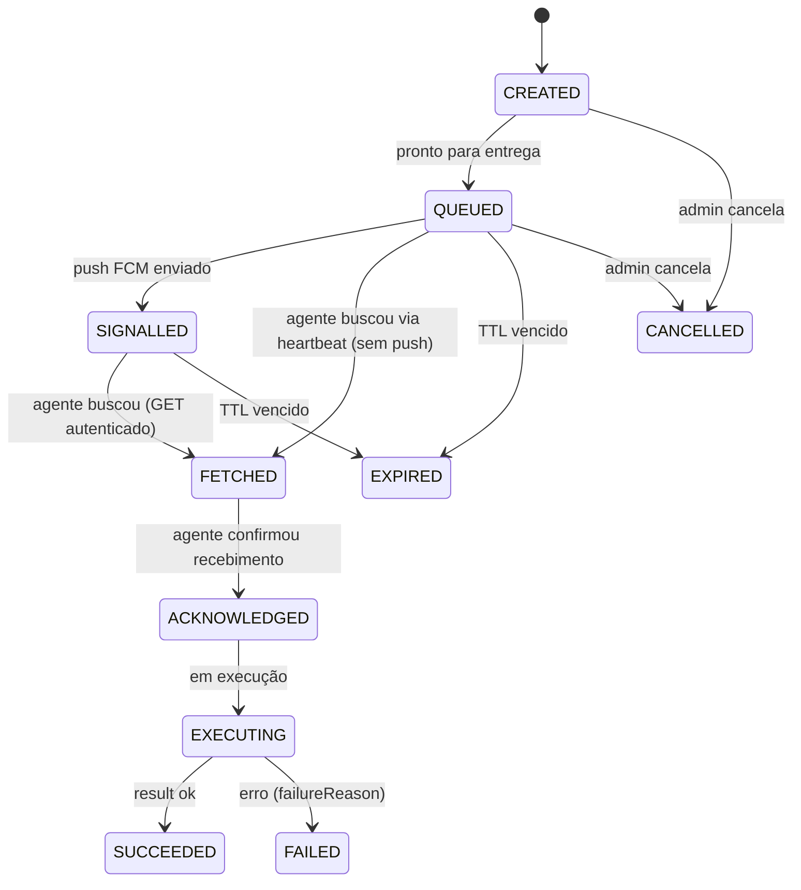

# Motor de regras, alertas e Command Center — NextGuardian

Data: 2026-09-11. Documento de desenho. Nada implementado.

## Parte I — Motor de regras e alertas

### 1. Modelo

Regra = **TRIGGER + CONDITIONS + ACTIONS**, avaliada no servidor sobre eventos/estado.

```
Rule {
  ruleId, tenantId, enabled
  trigger      // eventType ou avaliação periódica de DeviceState
  conditions[] // predicados sobre payload/estado (AND/OR)
  actions[]    // CREATE_ALERT | NOTIFY | ENQUEUE_COMMAND | TAG_DEVICE
  severity, cooldown, scope(deviceIds|tags|all)
}
```

Exemplo declarativo:
```
DEVICE_OFFLINE > 30min  →  CREATE_ALERT(severity=WARNING)
BATTERY < 10%           →  CREATE_ALERT(severity=NOTICE)
GEOFENCE_EXIT(zonaAutorizada) → CREATE_ALERT + NOTIFY(operator)
PERMISSION_REVOKED(location) → CREATE_ALERT(severity=WARNING)
AGENT_VERSION < mínimoSuportado → CREATE_ALERT + TAG(desatualizado)
POLICY_COMPLIANCE = NON_COMPLIANT → CREATE_ALERT(severity=CRITICAL)
```

### 2. Regras legítimas previstas

Dispositivo sem comunicação por período; bateria crítica; permissão importante revogada; agente desatualizado; política não atendida; saída de geofence autorizada; alteração relevante de segurança/integridade; (quando a plataforma permitir e for confiável) troca de SIM/eSIM e presença de app corporativamente proibido.

**Proibido:** regras cujo propósito seja capturar conteúdo privado (mensagens, chamadas, mídia) clandestinamente. O motor age sobre **postura e eventos**, não sobre conteúdo.

### 3. Alert

```
Alert {
  alertId, tenantId, deviceId, ruleId
  severity, createdAt, correlationId
  status: OPEN | ACKNOWLEDGED | RESOLVED
  acknowledgedBy/At, resolvedBy/At
}
```

Alertas têm `cooldown` para evitar tempestade (um device offline não gera um alerta por minuto). Deduplicação por `(ruleId, deviceId)` enquanto `OPEN`.

### 4. Estado atual

**NÃO EXISTE.** Fase 6 do [roadmap](implementation-roadmap.md), após event platform e device state.

---

## Parte II — Command Center

### 5. Modelo

Fila servidor→dispositivo, entregue via FCM data (com fallback no próximo heartbeat). Entrega é best-effort ⇒ **idempotência, ACK e expiração** são obrigatórios.

```
Command {
  commandId, tenantId, deviceId
  type            // catálogo fechado (abaixo)
  payload         // tipado por type
  requestedBy     // userId
  createdAt, expiresAt
  status          // PENDING | SENT | DELIVERED | EXECUTED | FAILED | EXPIRED | CANCELLED
  deliveredAt, executedAt
  result, failureReason
}
```

Ciclo de vida refinado (estados podem ser simplificados na implementação se redundantes):

Nota de simplificação: no MVP, `CREATED`/`QUEUED` podem colapsar, e `SIGNALLED`/`FETCHED` podem virar timestamps em vez de estados. O conjunto mínimo verificável é `QUEUED → FETCHED/ACKNOWLEDGED → SUCCEEDED/FAILED/EXPIRED/CANCELLED`. FCM é **sinal de disponibilidade**, não autenticação (doc 26).

- **Idempotência:** device executa por `commandId` uma única vez; reentrega não repete efeito.
- **Expiração:** comando vencido não executa (relógio do servidor manda).
- **ACK em duas etapas:** DELIVERED (recebeu) e EXECUTED (fez), com `result`.
- Todo comando gera `COMMAND_EVENT` na timeline e `AuditLog`.

### 6. Catálogo de comandos (fechado)

| Comando | Legitimidade | Requisito Android |
| --- | --- | --- |
| `REQUEST_CHECKIN` | sempre | nenhum |
| `SYNC_NOW` | sempre | nenhum |
| `UPDATE_POLICY` | sempre | nenhum |
| `REFRESH_DEVICE_INFO` | sempre | nenhum |
| `SHOW_MESSAGE` | sempre | notificação |
| `RING_DEVICE` | sempre | áudio local |
| `REQUEST_LOCATION` | **só com consentimento vigente** | permissão de localização |
| `REVOKE_ENROLLMENT` | sempre (admin) | invalida sessões |
| `LOCK_DEVICE` | **só Device/Profile Owner** | `DevicePolicyManager` |
| `WIPE_CORPORATE_DATA` | **só cenário MDM/DO** | perfil gerenciado |

**Fora do catálogo, proibido:** comandos de câmera, microfone, keylogger, leitura de SMS/notificações, captura de comunicações ou qualquer coleta clandestina. Não existe comando de "execução de código arbitrário".

### 7. Priorização de implementação

Começar por `REQUEST_CHECKIN`/`SYNC_NOW`/`SHOW_MESSAGE`/`RING_DEVICE`/`REFRESH_DEVICE_INFO` — legítimos, baratos, sem permissão sensível — para validar toda a mecânica (fila, FCM, ACK, expiração, idempotência) na fase 4. `LOCK`/`WIPE` só quando houver trilha MDM real.

### 8. Estado atual

**NÃO EXISTE.** Fase 4 do [roadmap](implementation-roadmap.md).
