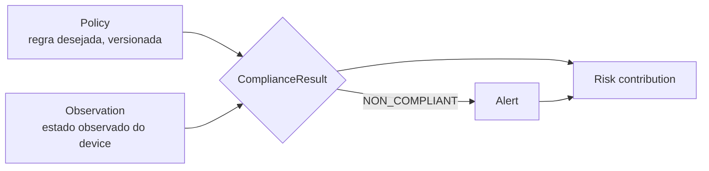

# Localização, Inventário e Device Risk Score — NextGuardian

Data: 2026-09-11. Documento de desenho. Nada implementado.

## Parte I — Localização e Geofence

### 1. Distinções que a arquitetura deve tornar explícitas

O modelo **não** pode confundir quatro coisas distintas:

| Conceito | Significado | Como o produto trata |
| --- | --- | --- |
| Localização **disponível** | o aparelho tem hardware/serviço de localização | capability, não estado de dado |
| **Permissão concedida** | usuário deu `FINE/COARSE` e, para bg, `BACKGROUND_LOCATION` | `locationCapability = NONE\|FOREGROUND\|BACKGROUND` |
| Localização **recente** | há uma posição com timestamp fresco | `staleLocation` se antiga |
| Localização em **background** | coleta com app fora de foco | exige permissão separada + política Play |

Ver [matriz Android](android-capability-matrix.md) §B.

### 2. Modelo de dado

```
LocationSample {
  deviceId, tenantId
  lat, lng, accuracyMeters
  source           // GPS | FUSED | NETWORK
  observedAt       // relógio do device (informativo)
  serverReceivedAt // autoridade
  stale(bool)      // derivado por limiar
  consentVersion   // consentimento vigente no momento da coleta
}
Geofence {
  geofenceId, tenantId, name
  center(lat,lng), radiusMeters
  schedule         // horários em que a regra vale
  transitions      // ENTER | EXIT | DWELL
  retentionDays
}
```

### 3. Regras

- Coleta só com **consentimento explícito e versionado**; sem consentimento, sem `LOCATION_EVENT`.
- **Não prometer rastreamento contínuo** — Android suspende background; disparos de geofence têm latência variável.
- Precisão pode ser só aproximada (usuário concede COARSE).
- Retenção configurável por tenant; revogação → exclusão conforme política (LGPD).
- Geofence gera `GEOFENCE_EVENT` (ver [doc 14](14-eventos-timeline.md)); regras de alerta em [doc 15](15-motor-regras-comandos.md).

### 3b. Geofence: círculo vs. polígono

**Círculos (center+raio) atendem ao MVP** e batem com a Geofencing API do Android (que é circular). Polígonos adicionam complexidade geoespacial (PostGIS, avaliação de contorno) sem benefício claro nas fases iniciais. Decisão: **círculo no MVP**; polígono só se um caso de uso real exigir. Transições: ENTER/EXIT/DWELL, com `schedule` (horários) e `activeState`.

### 4. Estado atual

**NÃO EXISTE.** Fase 5 do [roadmap](implementation-roadmap.md).

---

## Parte II — Inventário e postura do dispositivo

### 5. Campos (quando permitido pela plataforma)

```
DevicePosture {
  manufacturer, model
  androidVersion, apiLevel, securityPatchLevel
  agentVersion
  storageTotal/Free
  battery, charging
  networkType, connectivity
  capabilities     // location, telephony, etc.
  permissionsState // por permissão: GRANTED|DENIED|RESTRICTED|UNKNOWN
  integrity        // Play Integrity (futuro): OK|SUSPECT|UNKNOWN
}
```

Amplia o `DeviceInfo` já existente. **Sem IMEI/serial** (inacessíveis a apps normais); identidade é `installationId` próprio.

### 6. Estado atual

`DeviceInfo` **PARCIAL** existe no domínio. Ampliação entra junto do heartbeat (fase 2).

---

## Parte III — Device Risk Score (explicável)

### 6b. Pipeline Policy → Observation → Compliance → Alert → Risk

Não misturar **estado observado** com **política desejada**. São etapas distintas:

- **Policy**: o que se espera (versionada, por workspace).
- **Observation**: o que o device reporta (heartbeat/postura).
- **ComplianceResult**: `COMPLIANT | NON_COMPLIANT | UNKNOWN`, resultado de avaliar observação contra política.
- **Alert**: derivado quando uma regra eleva não conformidade/evento a acionável (doc 15).
- **Risk contribution**: cada não conformidade/fator contribui, de forma explicável, para o score abaixo.

### 7. Princípio

O score é **explicável**: o administrador vê *por que* recebeu a nota. Não há pretensão de precisão científica — é uma soma ponderada de fatores objetivos, com pesos configuráveis por tenant. Exemplo de saída:
```
riskScore: 42
reasons:
  - AGENT_OUTDATED +10
  - OFFLINE_TOO_LONG +20
  - REQUIRED_PERMISSION_MISSING +12
```
Nunca apresentar o score como diagnóstico absoluto.

### 8. Fatores objetivos propostos (pesos a calibrar)

| Fator | Sinal | Peso inicial (0–100) |
| --- | --- | --- |
| Sem comunicação | `PresenceState` = STALE/OFFLINE | 25 |
| Patch de segurança antigo | `securityPatchLevel` além do limite | 20 |
| Agente desatualizado | `agentVersion` < mínimo suportado | 15 |
| Política violada | `policyCompliance` = NON_COMPLIANT | 20 |
| Permissão essencial removida | permissão requerida = DENIED | 10 |
| Integridade suspeita | `integrity` = SUSPECT | 10 |

Score = soma dos fatores ativos, saturado em 100. Faixas: 0–29 baixo, 30–69 médio, 70–100 alto.

### 9. Requisitos

- Cada ponto do score tem **razão legível** (ex.: "+25 sem comunicação há 3 dias").
- Pesos e limiares configuráveis por tenant; padrão versionado.
- Recalculado em cada heartbeat/mudança de estado; histórico como `DEVICE_EVENT`.
- Nunca usar dados de conteúdo privado como fator.

### 10. Estado atual

**NÃO EXISTE.** Fase 6, depois de device state, políticas e eventos.
