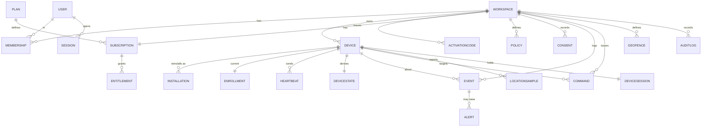

# Domínio, ERD conceitual e Tenancy — NextGuardian

Data: 2026-09-11. Documento de desenho. Estende o domínio em código (`domain/Models.kt`), não o substitui.

## 1. Tenancy neutra (ADR-0003)

Precisamos de isolamento desde o início, mas o perfil **Family não deve carregar complexidade empresarial**. Adotamos uma abstração única e neutra:

- **`Workspace`** — contêiner de isolamento. Pode representar **conta individual**, **família** ou **organização**. Tem `profile ∈ {INDIVIDUAL, FAMILY, BUSINESS}`.
- O código atual usa `Account`; a migração conceitual é `Account → Workspace` (ADR-0003 ACEITA no WP-101; preservar nomes do contrato/Android).
- **Isolamento é invariante e igual para todos os perfis.** RBAC e feature flags variam por perfil; o isolamento não.

Invariante de isolamento (teste obrigatório futuro):
```
Workspace A jamais lê/escreve Device/Event/Command/Location/Alert do Workspace B.
```
Toda tabela com dado de negócio carrega `workspaceId`; toda query é escopada por ele; acesso cruzado retorna 404/403, nunca vazamento.

Complexidade progressiva por perfil:
| Perfil | Membros | RBAC | Enrollment típico |
| --- | --- | --- | --- |
| INDIVIDUAL | 1 | owner | app instalado, consentido |
| FAMILY | poucos (responsáveis) | owner + membros | app consentido no aparelho do dependente |
| BUSINESS | muitos | owner/admin/operator/viewer | DO/PO provisioning |

## 2. Entidades — revisão crítica

Cada entidade é avaliada; **não** aceitamos a lista automaticamente. `Device` foi **decomposto** (evitar entidade monolítica): identidade estável (`Device`) × instalação do agente (`Installation`) × estado derivado (`DeviceState`, doc 12).

| Entidade | Necessária? | Identidade | Owner/boundary | Cardinalidade | Ciclo de vida / estados | Invariantes | Sensível | Retenção |
| --- | --- | --- | --- | --- | --- | --- | --- | --- |
| `Workspace` | sim | `workspaceId` | raiz | — | active/suspended/closed | `profile` imutável após criação (ou migração explícita) | nome | vida da conta |
| `User` | sim | `userId` | global (pode ter N memberships) | N usuários | active/disabled | e-mail único; senha só hash | e-mail (PII) | vida da conta |
| `Membership` | sim | `(userId,workspaceId)` | workspace | N por workspace | active/revoked | papel ∈ RBAC | — | vida |
| `Role`/RBAC | sim (enum) | — | workspace | — | — | owner/admin/operator/viewer | — | — |
| `Device` | sim | `deviceId` (server) | workspace | N por workspace | enrolled/revoked | pertence a 1 workspace | modelo | política |
| `Installation` | sim (nova) | `installationId` (client) | device | 1..N por device (reinstalação) | active/superseded/revoked | liga-se a `Device` no enrollment | — | política |
| `Enrollment` | sim | `enrollmentId` | device | 1 ativo por device | pending/confirmed/revoked | = `DevicePairingState` | — | auditoria |
| `ActivationCode` | sim | `code`(hash) | workspace | N | issued/consumed/expired | uso único; expira; atômico | código | curta |
| `Plan` | sim | `planId` | catálogo | — | — | limites como dado | — | — |
| `Subscription` | sim | `subscriptionId` | workspace | 1 ativa | trial/active/expired/cancelled + grace | datas em UTC no servidor | — | financeiro/legal |
| `Entitlement` | sim (nova) | `(workspaceId,feature)` | workspace | N | on/off | derivado de plano/assinatura | — | — |
| `Consent` | sim | `consentId` | workspace/device | N versionado | granted/revoked | version + purposes | evidência | legal ([doc 27](27-consentimento-versionado.md)) |
| `Policy` | sim | `policyId` | workspace | N versionada | draft/active/retired | versionada | — | auditoria |
| `DeviceState` | derivado | `deviceId` | device | 1 | derivado | não é verdade armazenada | postura | atual + histórico curto |
| `Heartbeat` | sim (ingestão) | `(deviceId,receivedAt)` | device | alto volume | append | serverReceivedAt autoridade | postura | agregar/curta |
| `Event` | sim | `eventId` | workspace/device | altíssimo volume | append-only | sem conteúdo privado | depende | por classe ([doc 14](14-eventos-timeline.md)) |
| `Alert` | sim | `alertId` | workspace/device | médio | open/ack/resolved | deriva de regra/evento | — | média |
| `Command` | sim | `commandId` | workspace/device | médio | ver [doc 15](15-motor-regras-comandos.md) | idempotente; TTL | payload | média |
| `CommandDelivery` | opcional | `(commandId,attempt)` | command | N tentativas | — | pode ser campos de `Command` no MVP | — | curta |
| `LocationSample` | sim | `(deviceId,serverReceivedAt)` | device | alto (se ativo) | append | consentimento vigente | **alta** | curta/configurável |
| `Geofence` | sim | `geofenceId` | workspace | N | active/inactive | círculo no MVP ([doc 16](16-localizacao-inventario-risco.md)) | — | vida |
| `AuditLog` | sim | `auditId` | workspace | alto | append-only, imutável | sem segredos | contexto | longa, separada |
| `Session` (humana) | sim | `sessionId` | user | N | active/revoked/expired | refresh rotacionado | tokens | curta |
| `DeviceSession` | sim | `sessionId` | device | 1 ativa | active/revoked | separada de FCM/conta | tokens | curta |
| `Notification` | sim | `notificationId` | user/workspace | N | — | canal/preferências | — | curta |

Decisões de modelagem:
- **`Installation` separada de `Device`**: reinstalar gera nova `Installation`, o `Device` (identidade lógica no workspace) persiste. Resolve clonagem/reinstalação sem confundir identidade.
- **`Entitlement` derivado**: a UI/agente consultam entitlements, não "o plano" diretamente.
- **`CommandDelivery`** pode começar como campos em `Command`; só virar tabela se retry/telemetria exigirem.
- **Telemetria (`Heartbeat`) ≠ `Event` factual ≠ `Alert` derivado ≠ `AuditLog`** — quatro fluxos distintos (doc 14/18).

## 3. ERD conceitual



## 4. Índices prováveis (para o backend, não criar agora)
- `device(workspaceId)`, `event(workspaceId, deviceId, occurredAt)`, `command(workspaceId, deviceId, status)`, `heartbeat(deviceId, receivedAt)`, `auditlog(workspaceId, createdAt)`, `membership(userId)`, `activationcode(codeHash)` único, `installation(installationId)` único.
- Particionamento por tempo em `event`/`heartbeat`/`locationsample` (doc 14).

## 5. Estado atual
`Account/User/Device/ActivationCode/Subscription/DeviceInfo` existem no domínio Kotlin (`IMPLEMENTADO`). `Workspace/Installation/Entitlement/Consent/Policy/Event/Alert/Command/Geofence/LocationSample/AuditLog/Session` são `DOCUMENTADO`. Nenhuma tabela/migration criada nesta rodada.


## 6. Implementação delimitada do WP-102 (2026-09-12)

Workspace, User e Membership agora possuem schema/migration Prisma e repositório Workspace/Membership escopado. Restante da tabela/ERD permanece documental. User é global conforme seção 2; Workspace é raiz; Membership contém workspaceId. PK composta e FKs garantidas no PostgreSQL. Profile obrigatório na criação, sem setter no repositório; SQL privilegiado não é protegido por trigger. Nenhum auth/RBAC enforcement/endpoint novo. Estados/roles são enums de persistência, não sistemas de autenticação.

Naming: identificadores conceituais explícitos workspaceId/userId e nomes padrão Prisma, sem convenção paralela. passwordHash nullable enquanto nenhum fluxo cria credencial; jamais senha plaintext. UNIQUE de email exato; normalização de login será tratada no WP-103 sem inventar política aqui. Testes de leitura/mutação cruzadas provam isolamento do repositório, não de futuros recursos Device/Event/Command que ainda não existem. [Evidências](wp-102-persistence-report.md).
