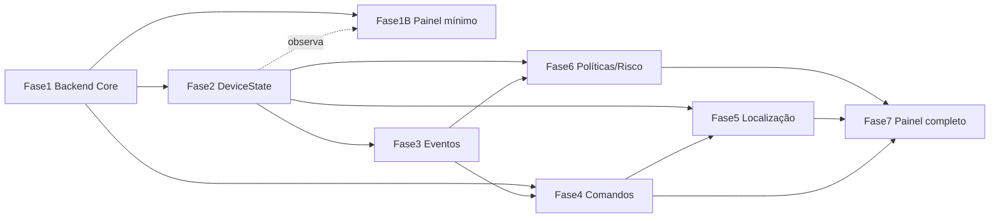

# Roadmap de implementação — NextGuardian

Data: 2026-09-11. Produto de planejamento. **Não** autoriza execução automática. Ordem sujeita à validação técnica das dependências.

## Filtro obrigatório por funcionalidade (antes de entrar no roadmap)

Nenhuma funcionalidade entra sem responder:
1. O que queremos resolver? 2. O Android permite de forma confiável? 3. Qual API oficial? 4. Que permissão exige? 5. Impacto em bateria? 6. Impacto em privacidade? 7. Precisa de servidor? 8. Precisa de FCM? 9. Precisa de Device Owner? 10. Como será auditado? 11. Já temos parte disso? 12. Qual dependência vem antes?

Referência das respostas: [matriz Android](android-capability-matrix.md) e [matriz mestra](feature-master-matrix.md).

## Ordem recomendada (revisada após inventário)

O inventário mostra que o **agente e os contratos já existem e são bons**; o que falta é **servidor real**. Por isso a fase 1 é backend, e o device state (fase 2) vem antes de eventos (fase 3), porque eventos e alertas consomem estado real.

### Fase 0 — Saneamento documental/contratual  · depende de: —
Decisões de produto já tomadas (2026-09-12): **marca** = `NextGuardian` comercial + `nexguardian` técnico mantido, sem renomear (ADR-0001 ACEITA); **perfil de MVP** = Family/Responsible (ADR-0014 ACEITA). Resta apenas saneamento leve e rápido, sem código de negócio: corrigir **encoding do OpenAPI** (doc 25), formalizar no contrato **Idempotency-Key** e **escopo de workspace no token**, e confirmar ADR-0012 (stack) e ADR-0003 (tenancy) — ambos podem ser confirmados no kickoff do WP-101. Executável em uma passada curta antes da Fase 1A.

### Fase 1 — Backend mínimo real (Core)  · depende de: contratos (existem) + Fase 0
Autenticação (conta), tenants (com `Tenant.profile`), usuários (RBAC), dispositivos, enrollment, ativação, trial transacional. Implementa os 10 endpoints já contratados. **Core profile-agnóstico** ([doc 13](13-modelo-produto-core-perfis.md)): planos/limites/trial como **dado configurável** (AD-16), não hard-coded. **Corta a maior lacuna** (tudo hoje é simulado). Entrega: API que o agente atual consegue consumir substituindo o mock.

Sugestão de recorte para reduzir escopo/consumo — **Fase 1A**: auth + tenant + device + enrollment/ativação + trial (o suficiente para o agente parar de simular). RBAC completo, refresh/rotação e billing podem vir logo em seguida (1A′), não tudo de uma vez.

### Fase 1B — Painel operacional mínimo  · depende de: fase 1A
Painel enxuto para desenvolvimento e operação inicial, **não** o painel completo: login, listar dispositivos, ver vínculo, ver trial/assinatura e — assim que a fase 2 existir — observar heartbeat/`DeviceState`. Serve para validar o backend e acompanhar o agente durante o desenvolvimento. O painel completo permanece na fase 7.

### Fase 2 — Device state real  · depende de: fase 1
Heartbeat de verdade (WorkManager + INTERNET no agente), `lastSeen`/`lastHeartbeat`/`lastSuccessfulSync`, bateria/rede, estado de permissões; derivação de presença/lifecycle no servidor ([doc 12](12-devicestate-heartbeat.md)). Entrega: status correto, nunca "connected por vínculo".

### Fase 3 — Plataforma de eventos  · depende de: fase 2
Ingestão idempotente, timeline por device, armazenamento com retenção, alertas básicos ([doc 14](14-eventos-timeline.md)). Dimensionar volume antes de codar.

### Fase 4 — Command infrastructure  · depende de: fases 1–3 + projeto Firebase
FCM data, fila de comandos, ACK em duas etapas, retry, expiração, idempotência ([doc 15](15-motor-regras-comandos.md)). Começar pelos comandos legítimos baratos (`REQUEST_CHECKIN`, `SYNC_NOW`, `SHOW_MESSAGE`, `RING_DEVICE`, `REFRESH_DEVICE_INFO`).

### Fase 5 — Localização  · depende de: fases 2–4
Localização consentida, histórico, geofence, retenção ([doc 16](16-localizacao-inventario-risco.md)). Requer revisão de política Play (background location) e consentimento versionado.

### Fase 6 — Políticas / compliance / risco  · depende de: fases 2–3
Políticas, avaliação de compliance, motor de regras/alertas, Device Risk Score explicável ([docs 15](15-motor-regras-comandos.md), [16](16-localizacao-inventario-risco.md)).

### Fase 7 — Painel web  · depende de: fases 1–6
Overview, Devices, Device Detail, Timeline, Alerts, Commands, account/subscription ([doc 17](17-painel-web.md)). Por último, pois consome tudo já real.

### Trilha Family / Responsible (transversal)
Ativa por feature flag no perfil FAMILY (doc 13): onboarding com consentimento (doc 27), localização consentida + geofence (Fase 5), alertas seguros (offline/bateria/geofence), `RING_DEVICE`/`SHOW_MESSAGE`, transparência/privacidade na UX (doc 31). Não exige DO/PO. **É o perfil do MVP** (ADR-0014 ACEITA) — Fases 1A/1B e a integração Android priorizam este fluxo.

### Trilha Business / MDM (transversal)
**Perfil posterior** (ADR-0014): não entra no MVP. Ativa no perfil BUSINESS, sobre o mesmo Core, sem duplicar backend: enrollment via Device/Profile Owner, enforcement de política/compliance (Fase 6), `LOCK_DEVICE`/`WIPE_CORPORATE_DATA`, inventário via managed config. Exige provisioning DO/PO; **não bloqueia** o Core nem as fases 1–7 e **não** é requisito do Core.

## Transversais (em todas as fases)
Segurança/autenticação/auditoria ([doc 18](18-seguranca-privacidade-threat-model.md)); LGPD; testes de isolamento entre tenants, replay, expiração, revogação, rotação de token, idempotência.

## Dependências (grafo)

**Perfis (transversal):** o Core nasce profile-agnóstico. Os perfis Family/Responsible e Business/MDM ([doc 13](13-modelo-produto-core-perfis.md)) são introduzidos progressivamente por feature flags — decidir no MVP qual perfil (ou ambos) e seu conjunto mínimo de capacidades (pergunta 4b do [doc 19](19-decisoes-perguntas-nao-implementar.md)). A trilha MDM (DO/PO, lock/wipe) pertence ao perfil Business e não bloqueia o Core.

## Não fazer
Não implementar fase alguma automaticamente após esta rodada. Não pular a fase 1 (sem backend, todo o resto continua simulado). Não usar Accessibility/Notification Listener/root. Ver [doc 19](19-decisoes-perguntas-nao-implementar.md).
